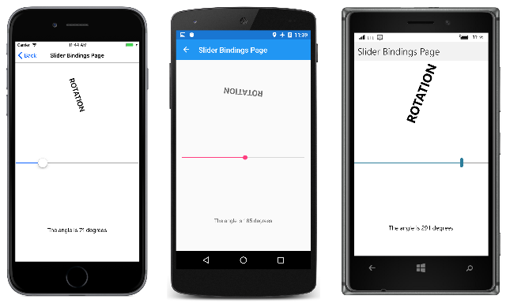

description: Data bindings allow properties of two objects to be linked so that a change in one causes a change in the other.

# Databinding 


Data bindings allow properties of two objects to be linked so that a change in one causes a change in the other.

## Setting up Binding

Databinding can be set both in code and in XAML. In both cases, it involves setting the `BindingContext` which is the source object.

In XAML setting the `BindingContext` could be done in the following ways:

* `BindingContext` in the code behind file or using property tags
* Using a static resource with `StaticResource` or with markup extension `x:Static`


## View to view data binding

In this example we will set the `slider` as the source and we use the `BindingContext` on the slider and use the markup extension `x:Reference` to refer to the source object. Within the `slider` we need to bind the `Rotation` property to the `slider's` `Value` property. Since the `slider` have many properties

```xml
<ContentPage xmlns="http://xamarin.com/schemas/2014/forms"
             xmlns:x="http://schemas.microsoft.com/winfx/2009/xaml"
             x:Class="XamlSamples.SliderBindingsPage"
             Title="Slider Bindings Page">

    <StackLayout>
        <Label Text="ROTATION"
               BindingContext="{x:Reference Name=slider}"
               Rotation="{Binding Path=Value}"
               FontAttributes="Bold"
               FontSize="Large"
               HorizontalOptions="Center"
               VerticalOptions="CenterAndExpand" />

        <Slider x:Name="slider"
                Maximum="360"
                VerticalOptions="CenterAndExpand" />

        <Label BindingContext="{x:Reference slider}"
               Text="{Binding Value, StringFormat='The angle is {0:F0} degrees'}"
               FontAttributes="Bold"
               FontSize="Large"
               HorizontalOptions="Center"
               VerticalOptions="CenterAndExpand" />
    </StackLayout>
</ContentPage>
```



## Binding Modes

We can change the `Mode` of the data binding using one of these options :

* **Default**
* **OneWay** — values are transferred from the source to the target
* **OneWayToSource** — values are transferred from the target to the source
* **TwoWay** — values are transferred both ways between source and target

## Binding ListView

We can use the power of data binding to bind to the `ItemSource` of the ListView. Here is a simple `ListView` bound to a collection of months.

