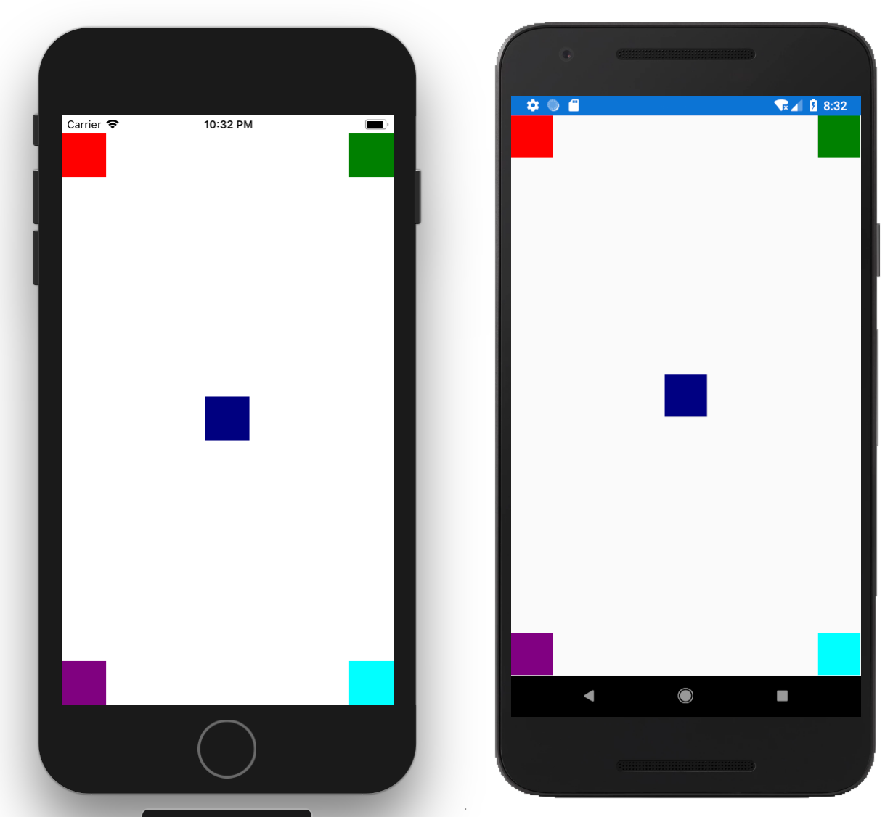

description: The AbsoluteLayout is used to position and size using absolute values or in proportions to the parent container.


# Absolute Layout



The `AbsoluteLayout` is used to position and size using absolute values or in proportions to the parent container.

## Purpose

* Position views on the edges e.g top, left, bottom, center
* Proportionally size views with their container, e.g half the size, same size or any proportion
* Create overlays by laying views on top of each other

## Specifying position and size values

The `AbsoluteLayout` have an attached property `AbsoluteLayout.LayoutBounds`. The property is a rectangle which defines 4 values :

* **X** – the x (horizontal) position of the view's anchor
* **Y** – the y (vertical) position of the view's anchor
* **Width** – the width of the view
* **Height** – the height of the view

Each of the values can be set as a proportional or an absolute value. Proportional values range from 0 to 1.

## Specifying how values will be interpreted

The `AbsoluteLayout` defines an attached property `AbsoluteLayout.LayoutFlags` which can hold the following values :

* **None** – interprets all values as absolute. This is the default value if no layout flags are specified.
* **All** – interprets all values as proportional.
* **WidthProportional** – interprets the Width value as proportional and all other values as absolute.
* **HeightProportional** – interprets only the height value as proportional with all other values absolute.
* **XProportional** – interprets the X value as proportional, while treating all other values as absolute.
* **YProportional** – interprets the Y value as proportional, while treating all other values as absolute.
* **PositionProportional** – interprets the X and Y values as proportional, while the size values are interpreted as absolute.
* **SizeProportional** – interprets the Width and Height values as proportional while the position values are absolute.

The value of the `AbsoluteLayout.LayoutFlags` can be a single value or a comma separated list of the above options.

## Position views flash on the edges and center

We can easily use the `AbsoluteLayout` to position views flash on the edges on the center as follows :

```xml
<?xml version="1.0" encoding="UTF-8"?>
<ContentPage xmlns="http://xamarin.com/schemas/2014/forms" xmlns:x="http://schemas.microsoft.com/winfx/2009/xaml" x:Class="LayoutSample.MediaPlayerPage">
    <ContentPage.Padding>
        <OnPlatform x:TypeArguments="Thickness" iOS="0,20,0,0" />
    </ContentPage.Padding>
    <ContentPage.Content>
        <AbsoluteLayout>
            <BoxView 
                BackgroundColor="Red" 
                WidthRequest="50" 
                HeightRequest="50" />
            <BoxView 
                AbsoluteLayout.LayoutFlags="PositionProportional"
                AbsoluteLayout.LayoutBounds="1,0"
                BackgroundColor="Green" 
                WidthRequest="50" 
                HeightRequest="50" />
            <BoxView 
                AbsoluteLayout.LayoutFlags="PositionProportional"
                AbsoluteLayout.LayoutBounds="0,1"
                BackgroundColor="Purple" 
                WidthRequest="50" 
                HeightRequest="50" />
            <BoxView 
                AbsoluteLayout.LayoutFlags="PositionProportional"
                AbsoluteLayout.LayoutBounds="1,1"
                BackgroundColor="Aqua" 
                WidthRequest="50" 
                HeightRequest="50" />
            <BoxView 
                AbsoluteLayout.LayoutFlags="PositionProportional"
                AbsoluteLayout.LayoutBounds="0.5,0.5"
                BackgroundColor="Navy" 
                WidthRequest="50" 
                HeightRequest="50" />            
        </AbsoluteLayout>
    </ContentPage.Content>
</ContentPage>
```