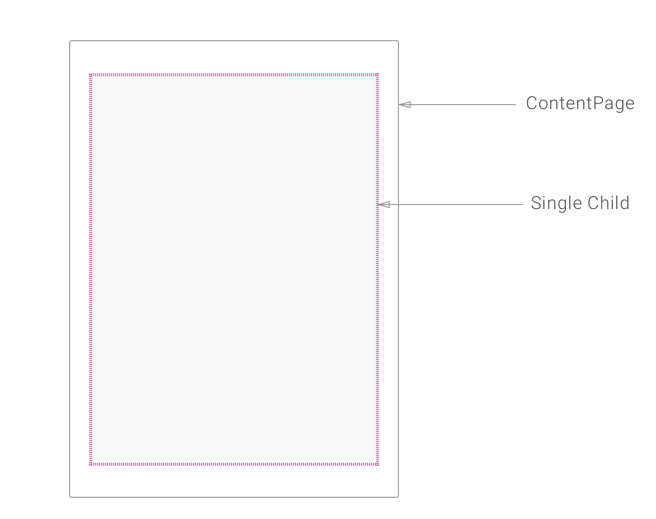

description: ContentPage is the simplest and most common Xamarin Forms Page. It contains only a single view and mostly its a StackLayout, GridLayout or ScrollView.

# ContentPage

A `ContentPage` is a single view and has one child. In most instances, the child is either one of the layouts, `StackLayout`, `ScrollView` or a `GridLayout`.

The default XAML page created with the **new project** template creates a `ContentPage`.



## ContentPage XAML

Here is the simple default `ContentPage` created with the **new project** template :

```xaml
<!-- Define the XML version being used -->
<?xml version="1.0" encoding="utf-8"?>
<!-- This defines the page as a ContentPage -->
<ContentPage xmlns="http://xamarin.com/schemas/2014/forms" 
             xmlns:x="http://schemas.microsoft.com/winfx/2009/xaml" 
             xmlns:local="clr-namespace:Intro" x:Class="Intro.MainPage">
    <!-- The single child of the ContentPage, in this instance its a StackLayout -->
    <StackLayout>
        <!-- Place new controls here -->
        <Label Text="Welcome to Xamarin.Forms!" 
               HorizontalOptions="Center" 
               VerticalOptions="CenterAndExpand" />
    </StackLayout>
</ContentPage>
```

The `ContentPage` is defined using the opening and closing `ContentPage` XML tags as follows :

```xml
<ContentPage>
 <!-- Place the single child here -->
</ContentPage>
```

When definig the `ContentPage` the following XML attributes are also defined :

- **xmlns** - This is the XML namespace used for the whole of the `ContentPage`.
- **xmlns:x** - The **x** within the **xmlns** defined previously provides a way to refer to the types defined in the XAML specification. Note that there's nothing special about **x**, it could have been any ;letter.
-- **xmlns:local** - The local is used to namespace types defined with your local project namespace. Nothing special too about **local**, it could have been naming anything really.

!!! note
  To create the association between this XAML file with its corresponding C# file the `x:Class="Intro.MainPage"` XML attribute is used.