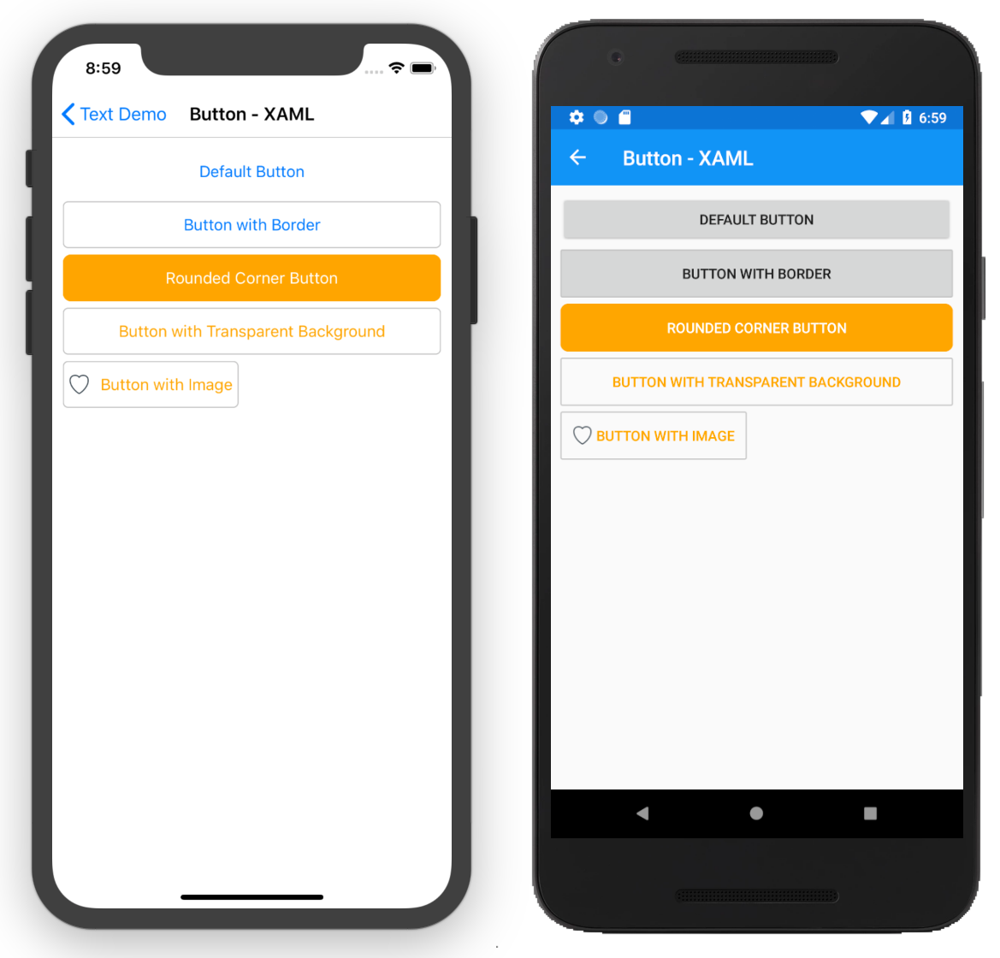
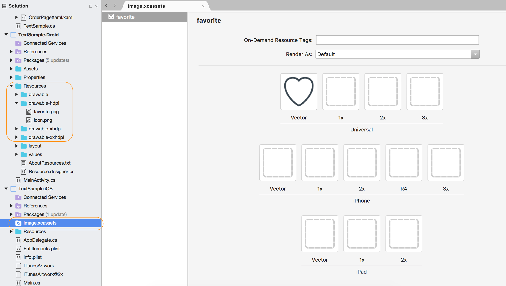

# Button


The `Button` view reacts to click events.

## Define in XAML

```xml
<Button Text="Login" />
```

## Define in Code

```csharp
var button = new Button
{
    Text = "Login"
};
```

## Add a Click Event

We can attach a Click event to the Button in XAML and define a function in the backing code file with the function to handle the Button click event as follows :

**In XAML**

```xml
<Button Text="Login" Clicked="OnLoginButtonClicked" />
```

**In Backing Code File**

```csharp
void OnLoginButtonClicked(object sender, System.EventArgs e)
{
    //Do something
}
```

**Define the Click Event in Code**

We can define the Button in XAML and attach the Click event in code. The Button will need to be named in XAML. We can give names to controls in XAML using the extension `x:Name` as following :

```xml
<Button Text="Login" x:Name="btnLogin" />
```

!!! note
    The `x:Name` is a namespace defined on the XAML content page as follows ` xmlns:x="http://schemas.microsoft.com/winfx/2009/xaml"`

A variable with the name `btnLogin` will be automatically generated and be available in the code file for the content page.    

**Wire Event in Code**

After defining the name, we can now access the variable and attach the `Clicked` event as follows :

```csharp
btnLogin.Clicked += (sender, e) => {
    //Do something
};
```


## Styled Button


On iOS, the default button does not have a border. We can add border, change the border color, border corners and background color using the `BorderWidth`, `BorderColor`, `BorderRadius` and `BackgroundColor`.

```xml
<StackLayout Padding="10">
    <Button Text="Default Button" />
    <Button Text="Button with Border" BorderWidth="1" BorderColor="Silver" />
    <Button 
        Text="Rounded Corner Button" 
        BorderWidth="1" 
        BorderColor="Orange" 
        BackgroundColor="Orange" 
        BorderRadius="8"
        TextColor="White" />
    <Button 
        Text="Button with Transparent Background"
        BorderWidth="1"
        BorderColor="Silver"
        TextColor="Orange"
        BackgroundColor="Transparent" />
    <Button 
        BackgroundColor="Transparent"
        Text="Button with Image" 
        TextColor="Orange"
        HorizontalOptions="Start"
        Image="favorite" 
        BorderColor="Silver" 
        BorderWidth="1" />
</StackLayout>
```

!!! note
    Remember if you are using images, you will need to add them to each project, Android and iOS. For Android, you need to add the images under `Resources\drawable-*` and for iOS you will need to add an `Asset` catalog and then add an `Image Set`. For iOS it's recommended to use vector formats so that you do not have to specify multiple images. 

## Circle Button

You will need to use a renderer in order to achieve this. The simplest way is to use a plugin. Here is a plugin that can achieve circle buttons, [Circle Button Plugin](https://www.nuget.org/packages/Plugins.Forms.ButtonCircle)

## Commanding with Button

!!! note
    Commanding is an advanced topic, we will explore this in much detail under the MVVM section. For now, we will go through the high level details on how to add a command to a button.

In using the MVVM(Model View-ViewModel) design pattern, there's a separation of the UI and business logic. If we had a button and we had some logic we wanted to run in the model, we can use the commanding interface to run our logic.

### Define the Command

We first need to define the command property. It should be of type `ICommand`. This is an interface that have a few methods.

```csharp
public ICommand DisplayAlertCommand { get; private set; }
```

### Initialize the command in the constructor

Next we need to initialize the command in the constructor of the model :

```csharp
public DemoViewModel(Page page)
{
    this._page = page;
    DisplayAlertCommand = new Command(ShowAlert);
}
```

and define the function that is called by the command, in our case we will show an alert using the `Page` `DisplayAlert` method as follows :

```csharp
private async void ShowAlert(object obj)
{
    await _page.DisplayAlert("Alert", "Howdy from Command Button", "OK");
}
```

### Initialize the model in the content page class

Once we have everything setup in the model, we can now create a new instance of the model and set it up as the `BindingContext` for our UI as follows :

```csharp
BindingContext = new DemoViewModel(this);
```

### Add the Binding to the button

Now we can bind the button to the command in our model in XAML as follows :

```xml
<Button Text="Bound to Command" Command="{Binding DisplayAlertCommand}" />
```

### Putting everything together

*Model\DemoModel.cs*

```csharp
public class DemoViewModel
{
    public ICommand DisplayAlertCommand { get; private set; }
    Page _page;

    public DemoViewModel(Page page)
    {
        _page = page;
        DisplayAlertCommand = new Command(ShowAlert);
    }

    private async void ShowAlert(object obj)
    {
        await _page.DisplayAlert("Alert", "Howdy from Command Button", "OK");
    }
}
```

*ButtonCommandPage.cs*

```csharp
public partial class ButtonCommandPage : ContentPage
{
    public ButtonCommandPage()
    {
        InitializeComponent();
        BindingContext = new DemoViewModel(this);
    }
}
```

*ButtonCommandPage.xaml*

```xml
<?xml version="1.0" encoding="UTF-8"?>
<ContentPage xmlns="http://xamarin.com/schemas/2014/forms" 
             xmlns:x="http://schemas.microsoft.com/winfx/2009/xaml" 
             x:Class="TextSample.Views.ButtonCommandPage">
    <ContentPage.Content>
        <Button Text="Bound to Command" 
                Command="{Binding DisplayAlertCommand}" />
    </ContentPage.Content>
</ContentPage>
```
