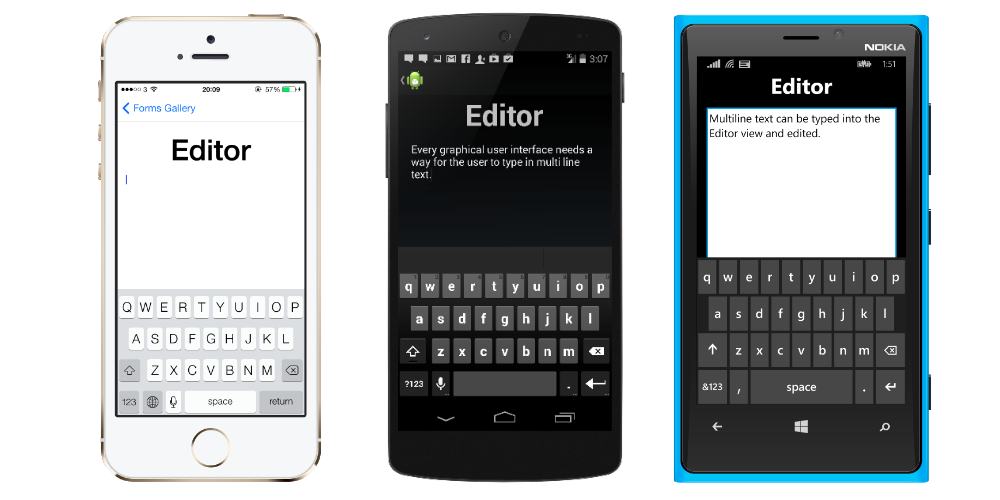

# Editor



The Editor is used when you want to edit multiple lines of text. Use the Entry for a single line of text.

## Define in XAML

```xml
<Editor Text="Lorem Ipsum is simply dummy text of the printing and typesetting industry. Lorem Ipsum has been the industry's standard dummy text ever since the 1500s, when an unknown printer took a galley of type and scrambled it to make a type specimen book. It has survived not only five centuries, but also the leap into electronic typesetting, remaining essentially unchanged. It was popularised in the 1960s with the release of Letraset sheets containing Lorem Ipsum passages, and more recently with desktop publishing software like Aldus PageMaker including versions of Lorem Ipsum." />
```

## In Code

```csharp
var editor = new Editor
{
    Text = "Lorem Ipsum is simply dummy text of the printing and typesetting industry." +
        "Lorem Ipsum has been the industry's standard dummy text ever since the 1500s, " +
        "when an unknown printer took a galley of type and scrambled it to make a type specimen book. " +
        "It has survived not only five centuries, but also the leap into electronic typesetting, " +
        "remaining essentially unchanged. It was popularised in the 1960s with the release of Letraset " +
        "sheets containing Lorem Ipsum passages, and more recently with desktop publishing software like " +
        "Aldus PageMaker including versions of Lorem Ipsum."
};
```

The Editor have the same properties as the Entry other than supporting multiple lines of text.

## Keyboard

We can also configure different keyboards for the `Editor` control.

```xml
<Editor Text="Default starting text" Keyboard="Chat" />
```

**Available Keyboards**

- **Default** – the default keyboard
- **Chat** – used for texting & places where emoji are useful
- **Email** – used when entering email addresses
- **Numeric** – used when entering numbers
- **Telephone** – used when entering telephone numbers
- **Url** – used for entering file paths & web addresses

## Events

The `Editor` reacts to text changed and text entry complete events using the `TextChanged ` and `Completed` events. The `Completed` event is fired when the return key is pressed.

The events can be set both in XAML and code

**TextChanged Event**

```xml
<?xml version="1.0" encoding="UTF-8"?>
<ContentPage xmlns="http://xamarin.com/schemas/2014/forms"
xmlns:x="http://schemas.microsoft.com/winfx/2009/xaml"
x:Class="TextSample.EditorPage"
Title="Editor Demo">
	<ContentPage.Content>
		<StackLayout Padding="5,10">
			<Editor TextChanged="EditorTextChanged" />
		</StackLayout>
	</ContentPage.Content>
</ContentPage>
```

Then in the backing code file you will have the following code :

```csharp
void EditorTextChanged (object sender, TextChangedEventArgs e)
{
	var oldText = e.OldTextValue;
	var newText = e.NewTextValue;
}
```
**Completed Event**

```xml
<Editor Text="Completed Event" Completed="Handle_Completed" />
```

and in the backing `.cs` file :

```csharp
void Handle_Completed(object sender, System.EventArgs e)
{
    lblPlaceholder.Text = ((Editor)sender).Text;
}
```

