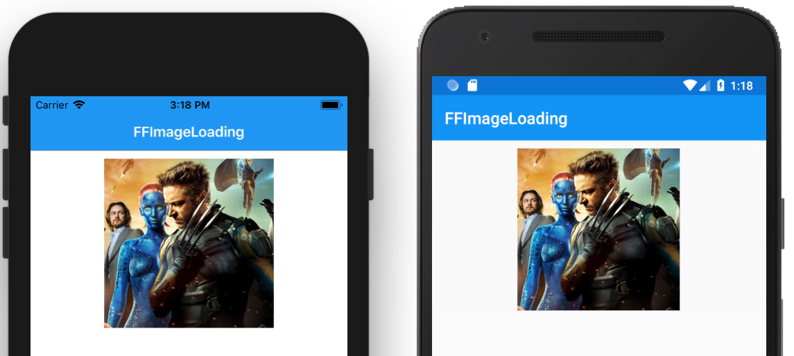

description: The control is used to display images.

# Image



The control is used to display images.

## In XAML

> Note that you will need to put the image into each platform.

```xml
<Image Source="logo" />
```

The logo.png image was added to the Android drawable folder and on iOS into the Assets.xcassets folder.

## In Code

**Local image**

```csharp
var localImage = new Image
{
    Source = "logo"
};
```

**Download image from the internet**

```csharp
var image = new Image
{
    Source = new UriImageSource
    {
        Uri = new Uri("https://i.imgur.com/OM81S7f.png")
    }
};
```

## Scaling and Resizing the Image

We can use the `WidthRequest` and `HeightRequest` to set width and height of the image as follows :

```xml
 <Image Source="logo" WidthRequest="70" HeightRequest="70"  />
```

In addition to setting the width and height of the image, you can also set the `Aspect` property as follows :

```xml
<Image Source="logo" WidthRequest="70" HeightRequest="70" Aspect="AspectFit" />
```

The available options are :
- AspectFit - Fit the set width and height and maintain the aspect
- AspectFill - Fill the set width and height and maintain the apsect
- Fill - Fill the set width and height

## Custom library for image loading and caching

There are many available image loading and caching that provides more functionality that the default `ImageView`, e.g you might want to retry get the image, show a placeholder image, an error image, control the caching duration or transform the image on the fly.

We are going to use the `FFImageLoading` library in place of the default `ImageView` so we can show a placeholder image whilst we fetch images across the network.

### Install the FFImageLoading

You will need to install the  following packages in both Android and iOS projects and also the shard project :

* Xamarin.FFImageLoading.Forms
* Xamarin.FFImageLoading.Svg.Forms
* Xamarin.FFImageLoading.Transformations

### Initialize each project

You will need run some setup code to initialize the rendered for each project.

**Android**

In the `MainActivity.cs` file add the following line :

```csharp
CachedImageRenderer.Init(true);
```

The `OnCreate` method should be look like this after adding the line :

```csharp
protected override void OnCreate(Bundle bundle)
{
    TabLayoutResource = Resource.Layout.Tabbar;
    ToolbarResource = Resource.Layout.Toolbar;
    CachedImageRenderer.Init(true);

    base.OnCreate(bundle);

    global::Xamarin.Forms.Forms.Init(this, bundle);

    LoadApplication(new App());
}
```

**iOS**

In the iOS project, add the following line in the `AppDelegate.cs` file :

```csharp
CachedImageRenderer.Init();
```

### Adding namespace

Add the namespace :

```xaml
xmlns:ffimageloading="clr-namespace:FFImageLoading.Forms;assembly=FFImageLoading.Forms"
```

### Add the image view

Once the namespace is defined you can now add the image view and customize the properties you require :

```xaml
<ffimageloading:CachedImage 
    WidthRequest="200" 
    HeightRequest="200" 
    LoadingPlaceholder="placeholder" 
    DownsampleToViewSize="true"
    Source="https://peruzal-parse-media.s3.amazonaws.com/652565bb-02ad-487f-929e-78308085ca1e_4.jpg" />
```

!!! note
    We have a placeholder image add to both Android and iOS projects.
