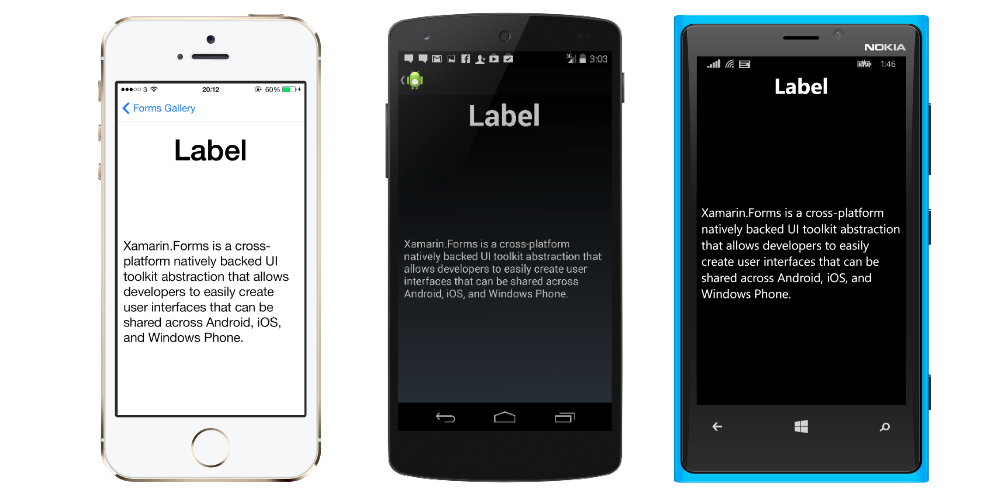

# Label View



The Label view is used to display read only text. The Label can be created both in XAML and in code.

## Defining a Label with XAML

```xml
<Label Text="Hello World" />
```

## Defining a Label in Code

```csharp
var label = new Label()
{
    Text = "Hello World"
};
```

## Changing Font Attributes

You can use the **FontSize** property. The number will be translated into Points on iOS and DPI on Android.

```xml
<Label Text="Hello World" FontSize="32" FontAttributes="Bold" />
```

We can set the same attributes in code :

```csharp
var label = new Label()
{
    Text = "Hello World",
    FontSize = 32,
    FontAttributes = FontAttributes.Bold
};
```

The recommended way to change the **FontSize** property is to use the platform's pre-defined size.

```csharp
var label = new Label()
{
    Text = "Hello World",
    FontSize = Device.GetNamedSize(NamedSize.Large, typeof(Label)),
    FontAttributes = FontAttributes.Bold
};
```

In XAML

```xml
<Label Text="Hello World" FontSize="Large" FontAttributes="Bold" />
```

## Formatted Text
Within a label, you can change the formatting for each individual text using `spans`. You set the `Label.FormattedText` in XAML and `FormattedText` in code.

```xml
<Label>
    <Label.FormattedText>
        <FormattedString>
            <Span Text="I" ForegroundColor="Red" FontAttributes="Bold" />
            <Span Text="Love" />
            <Span Text="Xamarin.Forms" FontAttributes="Italic" FontSize="Small" />
        </FormattedString>
    </Label.FormattedText>
</Label>
```

And we can achieve the same in code as follows :

```csharp
var formmattedString = new FormattedString();
formmattedString.Spans.Add(
    new Span()
    {
        Text = "I ",
        FontAttributes = FontAttributes.Bold
    });
formmattedString.Spans.Add(
   new Span()
   {
       Text = "love ",
       ForegroundColor = Color.Red,
   });
formmattedString.Spans.Add(
    new Span()
    {
        Text = "Xamarin.Forms",
        FontAttributes = FontAttributes.Italic,
        FontSize = Device.GetNamedSize(NamedSize.Small, typeof(Label))
    });


Content = new Label()
{
    FormattedText = formmattedString, 
    VerticalOptions = LayoutOptions.Center, 
    HorizontalOptions = LayoutOptions.Center
};
```

## Using Built-in Styles


Xamarin Forms comes with built-in styles for text. We can apply these using the `Style` property and also making sure we specify them using a `DynamicResource` so that they will always update when the style changes during running.

```xml
<Label Text="Title Style" Style="{DynamicResource TitleStyle}" />
<Label Text="Subtitle Style" Style="{DynamicResource SubtitleStyle}" />
<Label Text="Body Style" Style="{DynamicResource BodyStyle}" />
<Label Text="Caption Style" Style = "{DynamicResource CaptionStyle}" />
<Label Text="ListItemText Style" Style="{DynamicResource ListItemTextStyle}" />
<Label Text="ListItemDetailText Style" Style="{DynamicResource ListItemDetailTextStyle}" />
```

### Questions

!!! question
    Lorem ipsum dolor sit amet, consectetur adipiscing elit. Nulla et euismod
    nulla. Curabitur feugiat, tortor non consequat finibus, justo purus auctor
    massa, nec semper lorem quam in massa.

### Solution

!!! note
    Lorem ipsum dolor sit amet, consectetur adipiscing elit. Nulla et euismod
    nulla. Curabitur feugiat, tortor non consequat finibus, justo purus auctor
    massa, nec semper lorem quam in massa.    

