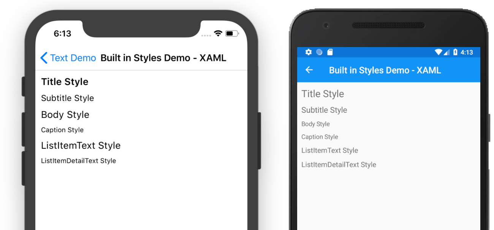

# Label View


The Label view is used to display read only text. The Label can be created both in XAML and in code.

## Defining a Label with XAML

```xml
<Label Text="Hello World" />
```

## Defining a Label in Code

```csharp
var label = new Label()
{
    Text = "Hello World"
};
```

## Changing Font Attributes

You can use the **FontSize** property. The number will be translated into Points on iOS and DPI on Android.

```xml
<Label Text="Hello World" FontSize="32" FontAttributes="Bold" />
```

We can set the same attributes in code :

```csharp
var label = new Label()
{
    Text = "Hello World",
    FontSize = 32,
    FontAttributes = FontAttributes.Bold
};
```

The recommended way to change the **FontSize** property is to use the platform's pre-defined size.

```csharp
var label = new Label()
{
    Text = "Hello World",
    FontSize = Device.GetNamedSize(NamedSize.Large, typeof(Label)),
    FontAttributes = FontAttributes.Bold
};
```

In XAML

```xml
<Label Text="Hello World" FontSize="Large" FontAttributes="Bold" />
```

## Formatted Text
Within a label, you can change the formatting for each individual text using `spans`. You set the `Label.FormattedText` in XAML and `FormattedText` in code.

```xml
<Label>
    <Label.FormattedText>
        <FormattedString>
            <Span Text="I" ForegroundColor="Red" FontAttributes="Bold" />
            <Span Text="Love" />
            <Span Text="Xamarin.Forms" FontAttributes="Italic" FontSize="Small" />
        </FormattedString>
    </Label.FormattedText>
</Label>
```

And we can achieve the same in code as follows :

```csharp
var formmattedString = new FormattedString();
formmattedString.Spans.Add(
    new Span()
    {
        Text = "I ",
        FontAttributes = FontAttributes.Bold
    });
formmattedString.Spans.Add(
   new Span()
   {
       Text = "love ",
       ForegroundColor = Color.Red,
   });
formmattedString.Spans.Add(
    new Span()
    {
        Text = "Xamarin.Forms",
        FontAttributes = FontAttributes.Italic,
        FontSize = Device.GetNamedSize(NamedSize.Small, typeof(Label))
    });


Content = new Label()
{
    FormattedText = formmattedString, 
    VerticalOptions = LayoutOptions.Center, 
    HorizontalOptions = LayoutOptions.Center
};
```

## Using Built-in Styles



Xamarin Forms comes with built-in styles for text. We can apply these using the `Style` property and also making sure we specify them using a `DynamicResource` so that they will always update when the style changes during running.

```xml
<Label Text="Title Style" Style="{DynamicResource TitleStyle}" />
<Label Text="Subtitle Style" Style="{DynamicResource SubtitleStyle}" />
<Label Text="Body Style" Style="{DynamicResource BodyStyle}" />
<Label Text="Caption Style" Style = "{DynamicResource CaptionStyle}" />
<Label Text="ListItemText Style" Style="{DynamicResource ListItemTextStyle}" />
<Label Text="ListItemDetailText Style" Style="{DynamicResource ListItemDetailTextStyle}" />
```

## LineBreak Mode  

Labels can be set to handle text that can't fit on one line in one of several ways, exposed by the LineBreakMode property. LineBreakMode is an enumeration of the following options:

* **HeadTruncation** – truncates the head of the text, showing the end.
* **CharacterWrap** – wraps text onto a new line at a character boundary.
* **MiddleTruncation** – displays the beginning and end of the text, with the middle replace by an ellipsis.
* **NoWrap** – does not wrap text, displaying only as much text as can fit on one line.
* **TailTruncation** – shows the beginning of the text, truncating the end.
* **WordWrap** – wraps text at the word boundary.

## Using a Custom Font

Custom fonts needs some configuration on each platform.

**iOS**

* Add the fonts to the `Resources` folder
* Add all the fonts to the `Info.plist` file under `Fonts provided by application`
* Now you can use the font in your app


**Using the font**

```xaml
<Label Font="Roboto-Thin" Text="Lorem Ipsum is simply dummy text of the printing" />
```

!!! danger
    On iOS the font might not show up. If the fonts are in a folder, make sure you include the folder path when adding the filename to the `Info.plist` you also include the folder name in the path. Also the extension is required, if you ommit it, the font will not show up. Make sure in the properties, you have specified `Copy to output folder` to be `Always copy` and the `Build action` is `BundleResource`.

**Android**

On Android do the following :

* Copy the font to the `Assets` folder
* Make sure in the properties the `BuildAction` is set to `AndroidAsset`
* Use the font. you have to use the full path of the font followed by a `#` and the font name e.g `ButterflyKids-Regular.ttf#Butterfly-Regular`

```xaml
<Label Font="ButterflyKids-Regular.ttf#Butterfly-Regular" Text="Lorem Ipsum is simply dummy"  />    
```

## Use different font for each platform

Once we have our fonts, we can use the `OnPlatform` and choose a different font for each platform :

```xaml
<Label Text="Lorem Ipsum is simply dummy text of the printing and typesetting industry.">
    <Label.Font>
        <OnPlatform x:TypeArguments="Font" Android="ButterflyKids-Regular.ttf#Butterfly-Regular" iOS="Roboto-Thin" />
    </Label.Font>   
</Label>   
```

